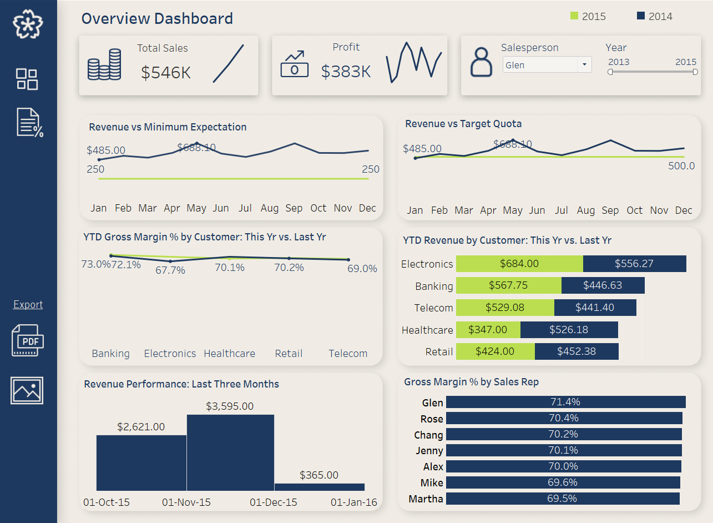
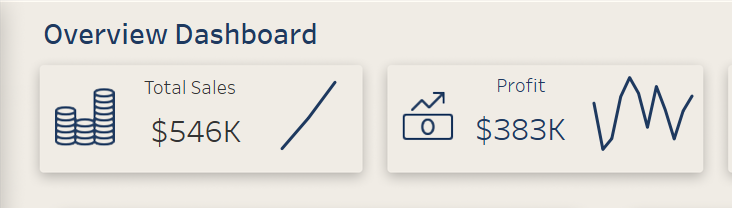

# Sales-Rep-Performance

## Introduction

This project aims to provide a comprehensive Tableau dashboard for monitoring sales representatives' performance. The dashboard will track key performance indicators (KPIs) such as monthly revenue, revenue quotas, and gross margin percentage. It also aims to visualize the YTD (Year-to-Date) Revenue by Customer, comparing the previous year versus the current year, as well as the YTD Gross Margin % by Customer. The central idea is to give sales reps and leadership an easy-to-use tool for visualizing and analyzing performance trends.

## Problem Statement

Sales teams, especially those operating at scale, often face the challenge of aligning their efforts with strategic objectives like hitting revenue targets and maintaining profitability. Without real-time, accurate performance metrics, sales representatives and leadership can become disconnected from the business's true state. The absence of such metrics, or reliance on inaccurate ones, can lead to several downsides:

1. Lack of Real-Time Insights.
2. Inability to Track Progress Against Quotas.
3. Misalignment Between Efforts and Results.
4. Lack of Granular Customer Insights.
5. Inconsistent or Poor Goal Setting.
6. Inability to Identify Top Performers and Areas for Improvement.
7. Low Morale and Motivation.

The ultimate goal is to create a dashboard that provides real-time insights:

1. Sales reps view personalized dashboards, seeing only their performance data.
2. Leadership sees aggregated team data, comparing revenue and margins across reps and customers.

## Skills Demonstrated

**SQL:** Used for querying and transforming raw sales data, including filtering out unnecessary columns, cleaning up missing values, and joining tables to create a structured dataset.

**Tableau:** Utilized to create a dynamic dashboard with interactive visuals. These visuals helped to track KPIs like YTD revenue by customer, gross margin %, and monthly performance trends.

**Excel:** Used to open and explore the dataset for the first time. Initial exploratory analysis was done in Excel to better understand the structure and key aspects of the data before cleaning and transformation in SQL.

**Data Analysis:** Conducted in-depth analysis of key performance indicators (KPIs) such as YTD revenue, gross margin %, and monthly sales trends. This included analyzing performance against quotas and identifying trends to support sales strategy decisions.

## Soft Skills Demonstrated

**Attention to Detail:** Ensured accuracy at every stage of the process, from data cleaning in SQL to carefully designing the Tableau dashboard. Paid close attention to how each metric would be visualized and interpreted.

**Problem-Solving:** I addressed missing or inaccurate data during the cleaning and transformation phases, ensuring the final analysis was based on reliable data. Additionally, I tackled the challenge of creating clear, actionable insights from complex data.

**Critical Thinking:** Applied analytical thinking to determine which KPIs and metrics would be most helpful in tracking sales performance, revenue trends, and sales rep performance. I thought critically about how each visual could provide value to both sales reps and leadership.

**Communication:** Communicated findings through well-structured visuals that are easy to interpret for technical and non-technical stakeholders. The dashboard was designed to tell a straightforward story with the data, aiding decision-makers in their day-to-day operations.

**Time Management:** Efficiently managed the entire data pipeline—from exploration to cleaning, transformation, analysis, and final dashboard creation—within project deadlines.

**Adaptability:** Utilized multiple tools (Excel, SQL, Python, and Tableau) to adapt to the different stages of the data analysis process, ensuring the project ran smoothly from start to finish.

## Data Sourcing

The dataset used in this project was sourced from [Kaggle]([https://www.example.com](https://www.kaggle.com/datasets/a78aniketnagdeo/sales-rep-sample-dataset/data)) and contains historical sales information, including columns such as:

Sales Value: I treated the total sales for each transaction as the revenue.
Cost: The cost associated with the product sold.
Date, Customer Industry, Sales Channel, Brand, and Sales Rep.

## Data Transformation

The raw data required extensive preprocessing and transformation to ensure consistency and correctness before analysis. SQL was primarily used for data cleaning and transformation, with additional calculated fields created in Tableau for specific metrics. The transformation process involved the following steps:

**Removing Null or Duplicate Entries:** To maintain the integrity of the analysis, SQL queries were used to eliminate rows with missing or duplicate data.

**Data Structuring:** Sales data was segregated by Sales Rep and Customer to enable a more granular analysis. This helped focus the dashboard on individual performance and overall customer revenue trends.

**Gross Margin %:** A calculated field in Tableau to track gross margin as a percentage of total revenue. This key metric helped visualize profitability trends.
Profit: A calculated field to visualize the total profit generated by each sales rep and customer segment.

**YTD Gross Margin %:** Created in Tableau to compare year-to-date gross margin performance across customers and periods. This allowed leadership to track progress against the previous year.

Data was further aggregated to create high-level KPIs, such as Total Revenue and Total Gross Margin.
Segregated by Region and Sales Channel to allow multi-dimensional insights into sales performance across different segments.

## Analysis and Visualization

Let's break them down into individual worksheets:

### Monthly Revenue vs. Minimum Expectation Quota:

This visualization displays Monthly Revenue against the Minimum Expected Quota ($250) for all sales reps over a year. It effectively shows how revenue fluctuates month by month and highlights when sales exceed or fall below the set quota. The green line representing the $250 expectation is consistently lower than actual revenue across all months for all sales reps, indicating the sales team consistently surpassed this target.

Overall, revenue remained above the minimum expectation throughout the year, demonstrating solid sales performance.

### Revenue vs. Target Quota

This second graph showcases a Revenue vs. Target Quota chart for a single sales rep with a target quota of $500. The performance comparison across the months is insightful for understanding trends within the sales data.

Multiple sales reps must catch up to the quota, which suggests issues like seasonal variability, differences in customer demand, or potential internal factors like reps' engagement or resources. This data can propel a strategy revaluation and prompt a deeper dive into identifying common months of underperformance. It may help in understanding whether external factors impact sales or if sales strategy and training adjustments could improve outcomes.

### Gross Margin % by Sales Rep

**Key Observations:**

* A high-performance cluster indicates sales reps are maintaining healthy profit margins. The top performers in terms of gross margin percentage are Glen (71.4%), Rose (70.4%), and Chang (70.2%).
* The highest performer is 71.4% (Glen), and the lowest is 69.5% (Martha). The difference between the top and bottom performers is 1.9%. This indicates that most sales reps perform similarly in gross margin percentage, staying close to 70%.

**Sales Rep Ceiling?**

* Given the small range of gross margin percentages across reps, these reps likely reached a performance ceiling. This ceiling may stem from factors such as **pricing strategies**, **cost structures**, or the **specific market conditions** in which they operate.
* If most reps are hovering around the 70% gross margin mark, further profitability increases may be limited without revisiting strategies such as **cost reduction**, **more favorable supplier agreements**, or **premium pricing on higher-value offerings**.

### YTD Gross Margin % by customer industry: This year vs. Last year

**Key Insights:**

* **Banking:** The gross margin for Banking customers decreased slightly by 0.9%. The margin is still high, but it indicates a small dip in profitability compared to last year.
* **Electronics:** Electronics shows a significant improvement in gross margin, increasing by 3.8%. This could suggest better pricing strategies, lower costs, or more profitable customer engagements in this industry in 2015.
* **Healthcare:** There was a minor drop of 1.4% in Healthcare. Though the change is not drastic, it reflects a slight loss in profitability in this sector.
* **Retail:** Retail is almost flat, with a tiny 0.3% decrease. This indicates stable performance in this sector year over year, with no significant changes.
* **Telecom:** Telecom shows a slight 0.8% decline. The decrease is not alarming, but it could be worth investigating to ensure margins don’t decline further.

The differences between 2014 and 2015 gross margins across all industries are relatively minor, except for Electronics, which shows a strong positive performance. The stability across most industries could indicate that sales reps are consistently managing costs and pricing strategies. However, the drop in sectors like Healthcare, Telecom, and Banking could imply that further attention may be needed to maintain or improve margins in these areas.

The improvement in Electronics suggests that whatever changes were made (e.g., better pricing, cost reduction, or targeting high-margin customers) have worked well. Similar strategies could be explored for industries like Banking and Healthcare to prevent further drops.

### YTD Revenue by Customer: This Year vs. Last Year

**Key Insights:**

* **Electronics:** Revenue for the Electronics industry has increased significantly by $127.73. This is a positive growth trend, indicating solid sales performance in 2015.
* **Banking:** Revenue from Banking customers has grown by $121.12, reflecting healthy expansion in this sector.
* **Telecom:** Telecom also shows a solid revenue increase of $87.68, marking a steady performance improvement compared to last year.
* **Healthcare:** Healthcare revenue has dropped significantly by $179.18, which is concerning. This industry is facing challenges, possibly due to a loss in market share or lower demand in 2015.
* **Retail:** Retail revenue has decreased slightly by $28.38, indicating a slight downturn. While this is not a significant decline, it may still warrant attention to prevent further drops.

Leverage the momentum in the Electronics and Banking sectors to maintain or accelerate growth. In addition, improving the significant decline in Healthcare revenue should be a priority. Revisiting sales strategies in Retail would help ensure that the slight downturn doesn't escalate into a larger problem.

### Revenue Performance: Last Three Months

* **November 1st, 2015 to December 1st, 2015:** This period marks the highest sales figure, showing a significant boost in business activity. The substantial increase suggests a possible seasonal surge, end-of-year promotions, or higher customer demand during the holiday season.
* **October 1st, 2015 to November 1st, 2015:** This month-to-month growth is also strong but less dramatic than the November-December spike. The steady increase in this period suggests a building momentum, perhaps from strategic sales efforts leading up to the end of the year.
* **December 1st, 2015 to January 1st, 2016:** Although slightly lower than October to November, this still shows consistent performance. This period includes the holiday season, and while growth is smaller, it indicates that the business managed to maintain solid revenue even during the transition into the new year.

The overall business growth picture from revenue perfromance reflects a healthy and upward trajectory in sales. While individual sales reps could be broken down in detail, it's clear that the collective effort of the sales team contributed to these significant results. This likely indicates that sales reps performed well in identifying and closing opportunities, contributing to the overall business growth.

It’s the data also highlights opportunities for further optimization, particularly by understanding and replicating the success factors that led to the November surge.

## KPI'S

### Sales Performance Over Time:
* 2013: **$177,015**
* 2014: **$181,656**
* 2015: **$187,045**

The data shows an upward trajectory over the three-year period from 2013 to 2015, with consistent growth year over year.

**Yearly Growth Rates:**
2013 to 2014: +$4,641 (approximately **2.6%** increase)
2014 to 2015: +$5,389 (approximately **3%** increase)

The increasing sales figures indicate a stable business environment, with moderate but consistent growth. The incremental rise in each year suggests that the business is performing well, gradually expanding its market reach or improving its operations.

### Profit Performance:

* Profit: $383K from $546K in sales, which translates to a 70.1% profit margin.
* The 70.1% profit margin is impressive and indicates strong cost management. The business is able to retain a large portion of its revenue as profit, which is a very positive indicator for its overall financial health.
* Despite possible challenges over the years, the steady increase in sales implies that the business has built a resilient customer base, likely experiencing low churn and capturing new clients.

## Risk Factors and Recommendations 

**1. Market Saturation:**

* From the visuals and KPIs, the business is showing consistent sales growth year over year. However, there is a potential risk of market saturation, especially if the current customer base becomes fully tapped. The company may not be able to sustain its growth indefinitely within the same market segments.
* YTD Revenue by Customer (This Year vs. Last Year) highlights that some customers, like Electronics and Banking, are showing stronger growth than others (e.g., Healthcare and Retail). This uneven growth might indicate saturation in certain sectors, and the company needs to watch for any signs of stagnation in key markets.
* To mitigate this, the business should consider expanding into new customer segments or geographical markets and look into diversifying products/services to avoid over-reliance on a few core industries.

**2. Customer Concentration:**

* Looking at the YTD Revenue by Customer data, certain sectors like Electronics and Banking are responsible for a significant portion of total revenue. Electronics alone is contributing substantially higher compared to other sectors. This presents a customer concentration risk: over-reliance on a few industries or customers means that any downturn in these sectors could disproportionately impact the business.
* To mitigate this risk, the company should focus on broadening its customer base by developing more revenue streams from underperforming sectors, such as Telecom or Healthcare, which have more room for growth.

**3. Pricing & Profit Margins:**

* With the 70.1% profit margin, the business is currently enjoying strong profitability. However, this could be vulnerable to external factors like cost inflation (e.g., raw materials, labor, or energy costs) or pricing pressure from competitors, especially as the business grows and attracts more competition.
* Maintaining this margin will require a careful balance between keeping costs in check and continuing to offer competitive pricing. Cost optimization and process efficiencies will be crucial as the business scales to avoid shrinking margins.

**4. Sales Team Performance:**

* The aggregated sales data shows strong performance overall, but referencing the performance of individual sales reps suggests that some sales reps are driving more revenue than others. While this isn't explored in detail, it's worth considering that disparities in performance could create bottlenecks in growth.
* A sales team review could help identify underperforming reps and provide additional training or support to ensure all team members are contributing effectively. Incentive structures could also be adjusted to motivate higher performance.

**5. Competition:**

* Although the current sales growth is promising, the increasing competition in the market may lead to challenges. Competitors might offer lower prices or introduce innovative products that could erode the business's market share.
* To stay competitive, the company should invest in market research, monitor competitor actions closely, and continually seek ways to differentiate itself—whether through customer service, product innovation, or technology.

## Conclusion

The Sales Rep Performance Dashboard reflects steady growth, with total sales reaching $546k and a 70.1% profit margin. Sales have shown an upward trajectory from 2013 to 2015, highlighting consistent business expansion. However, **market saturation**, and **customer concentration** risks need to be monitored as the company scales. While some sales reps drive more revenue than others, overall team performance supports growth, but disparities in individual contributions should be addressed. 

To maintain momentum, the business should focus on diversifying markets, optimizing operations, and monitoring competition.

